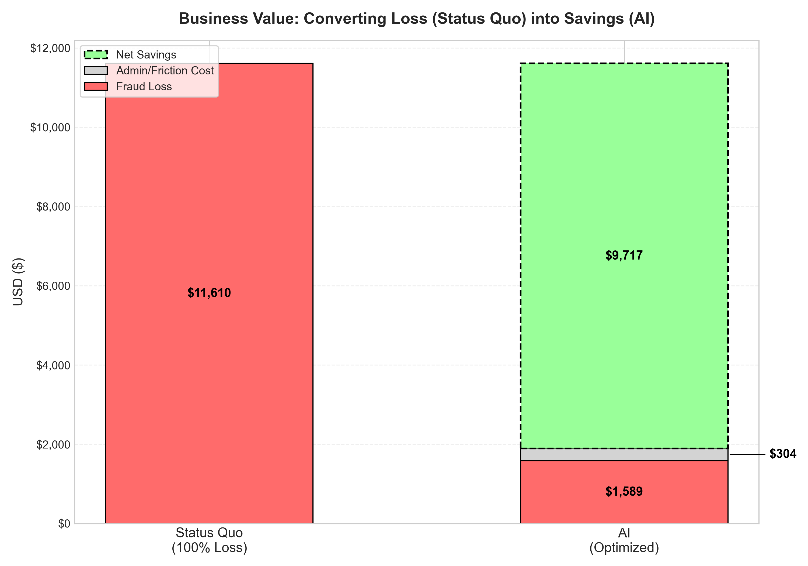

# 🛡️ Intelligent Credit Card Fraud Detection System


> **A Cost-Sensitive AI Approach to Minimizing Financial Risk.**

## 📖 Executive Summary
In financial fraud detection, standard accuracy is a misleading metric. A model can be 99.8% accurate and still fail to catch a single fraud case. 

This Capstone Project moves beyond basic classification to implement **Cost-Sensitive Learning**. By analyzing the asymmetric costs of fraud (average cost of **$122** per missed theft) vs. prevention (approx. **$2** per alert), we engineered a model that optimizes for **ROI** rather than just mathematical precision.

**Key Outcome:** The final model achieves a **Net Savings of ~$9,717** per test batch with a projected **ROI of >3,000%**.

---

## 📉 The Problem Statement
Credit card fraud is a "Needle in a Haystack" problem (Imbalanced Classification):
* **The Data:** 284,807 transactions, but only **492 (0.17%)** are fraudulent.
* **The Risk:**
    * **False Negative (Missed Fraud):** The bank loses the full transaction value (~$122).
    * **False Positive (False Alarm):** The bank pays a small administrative fee (~$2) and risks annoying the customer.
* **The Goal:** Deploy a model that maximizes **Net Savings** (Money Recovered - Operational Costs).

---

## 📊 The "Algorithm Battle"
We conducted a rigorous cross-validation tournament to benchmark four distinct algorithms. The goal was to balance **Recall** (Safety) with **Inference Speed** (Real-time capability).

| Model | AUPRC Score| Training Time | Verdict |
| :--- | :---:| :---: | :--- |
| **Logistic Regression** | 0.69 | **2.67s** | Baseline |
| **Neural Network (MLP)** | 0.76 | 49.48s | Too Slow |
| **Random Forest** | 0.76 | 8.92s | Strong Contender |
| **XGBoost** | **0.84** | 0.92s | **BEST MODEL** |

---

## 💰 Business Impact Analysis
We translated the model's performance into concrete financial metrics using a custom simulation.



* **Red Bar:** Financial loss from fraud.
* **Gray Bar:** Operational cost of running the AI (admin/friction).
* **Green Bar:** The **Value Saved** by the model.

**Final ROI:** For every $1 spent on monitoring, the system saves approximately **$31.96**.

---

## 📂 Dataset Info
The project utilizes the **European Credit Card Fraud** dataset (Sept 2013).
* **Source:** **OpenML Repository (ID: 43627)**.
* **Smart Loading:** The notebook includes an auto-fetch mechanism. If the data file (`creditcard.csv`) is not found locally, it automatically connects to the OpenML API to fetch the live dataset.
* **Privacy:** Features `V1`, `V2`...`V28` are the result of a PCA transformation to protect user confidentiality. Only `Amount` and `Class` are original.

---

## ⚙️ Installation & Usage

### 1. Clone the Repository
```bash
git clone [https://github.com/YOUR_USERNAME/Credit-Card-Fraud-Detection.git](https://github.com/ecbaldono/Credit-Card-Fraud-Detection.git)
cd Credit-Card-Fraud-Detection

### 2. Install Dependencies
```bash
pip install -r requirements.txt

### 3. Run the Analysis
**Note on Data:** You do **not** need to manually download the dataset. The notebook includes an auto-fetch mechanism that will automatically download the data from OpenML (ID: 43627) on the first run.
```bash
jupyter notebook notebooks/ernesto_baldono_jr_capstone.ipynb
*(Alternatively, you can open the notebook in VS Code and click "Run All".)*

---

## 📂 Repository Structure
* `notebooks/`: Contains the main analysis file (`.ipynb`).
* `models/`: Serialized model artifacts (`.pkl`) including the scaler and threshold metadata.
* `images/`: Generated visualizations for the executive report.

---

## 👤 Author
**Ernesto Baldono Jr.**
* [LinkedIn](https://www.linkedin.com/in/ecbaldono)
* [Email](mailto:ebaldonojr@gmail.com)

---
*This project was completed as part of the AIM Machine Learning Capstone.*


